# Hidlow Tools GUI

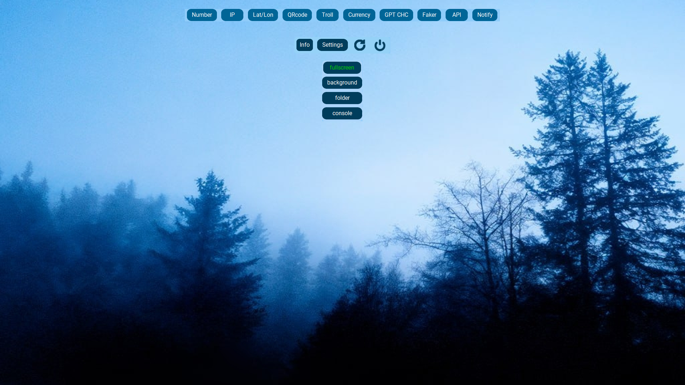

***
[Функции](#функции)  ||  [Boottraper](#boottraper) || [Console](#console) || [Доп.Функционал](#дополнительный-функционал) || [Установка](#установка)
***
**Все персональные данные, показанные на скриншотах, являются вымышленными.**

**All personal data shown in the screenshots are fictitious**
***

## Russian version

### Проект ``HidlowToolsGUI`` - это небольшой сборник утилит обёрнутый графический интерфейс. В нем имеется более ``14 функций``
***
### Функции
**1. ``Number`` - функция, с помощью которой вы можете узнать информацию о мобильном номере телефона.
Использует один из [htmlweb API](https://htmlweb.ru) и выводит более 28 строк с информацией.**

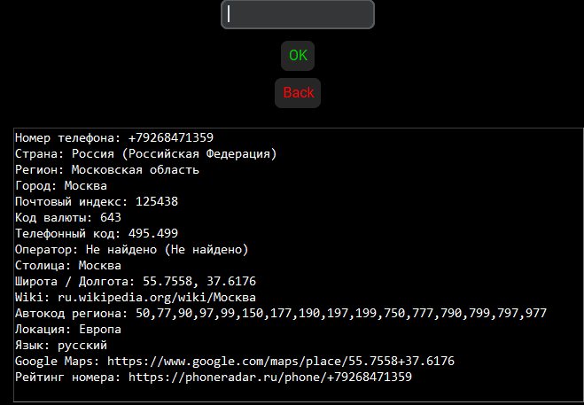

**2. ``Lat/Lon`` - функция, с помощью которой вы можете узнать информацию о координатах по долготе(_lat_) и широте(_lon_).  
Использует [openstreetmap API](https://nominatim.openstreetmap.org) и выводит более 18 строк с информацией**

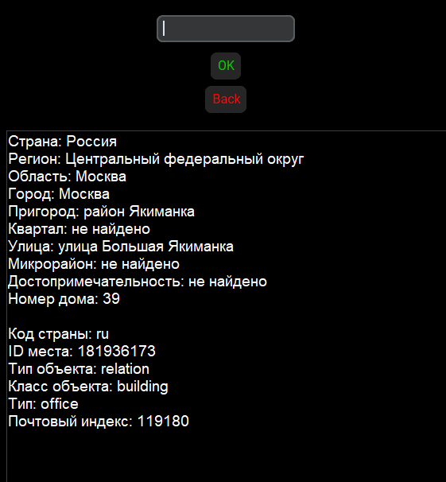

**3. ``IP`` - функция, с помощью которой вы можете узнать информацию о IP.  
использует [whois API](https://ipwhois.app) и выводит более 22 строк с информацией**

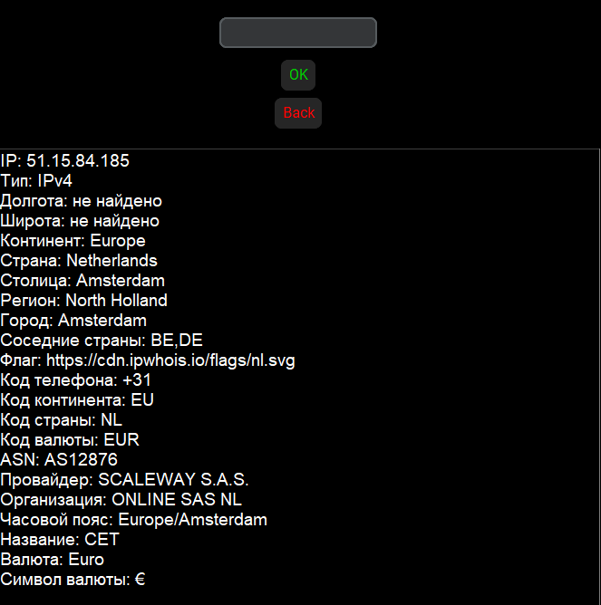

**4. ``QRcode`` - функция, с помощью которой вы можете создавать QRcode в формате ``.png``.  
достаточно просто ввести ``url``, например: ``https://example.com`` и скрипт сам создаст вам готовый файл**

**5. ``FlaskAPI`` - отдельный скрипт, с помощью которого вы можете запустить свой ``API сервер``  
подробно по ссылке: [HidlowAPI](https://github.com/hiikikomorii/API-Server)**

**6. ``Troll`` - отдельный скрипт, который за вас печатает огромное кол-во текста, в которых содержатся провакационные предложения  
подробно по ссылке: [automated-input](https://github.com/hiikikomorii/automated-input)**

**7. ``Faker`` - популярная библиотека для вывода фейковых данных.  
имеет в себе следующие языки: ``Russian`` ``English`` ``Spanish`` ``Japanese``**

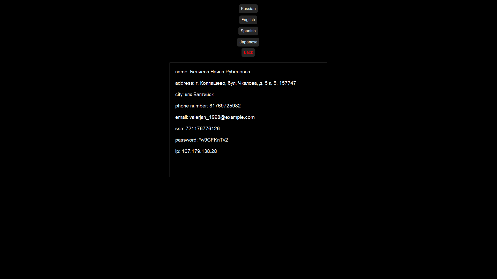

**8. ``Currency`` - показывает текущий курс ``BTC`` и ``TON``.  
Использует [Coinpaprika API](https://api.coinpaprika.com) и выводит курс в ``RUB`` & ``USD``**

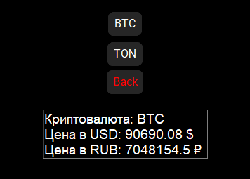 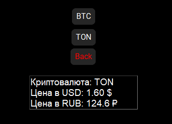

**9. ``GPT CHC`` - GPT Chat History Converter.  
Когда вы экспортируете чаты из ``ChatGPT``, вы получаете ``zip-файл``, в котором находится ``conversations.json`` - это ваша история чатов.
Скрипт конвертирует этот файл в .txt для удобного чтения.**
**Поместите .json файл в ту же директорию, что и ``main.py``, 
затем запустите функцию и введите название чата в консоль. После конвертации в той же директории появится ``chat_export.txt``.**

**10. ``Windows Notify`` - создает оконное уведомление используя ``ctypes``
подробно по ссылке: [Windows-notifications](https://github.com/hiikikomorii/Windows-notifications)**

***
### Boottraper
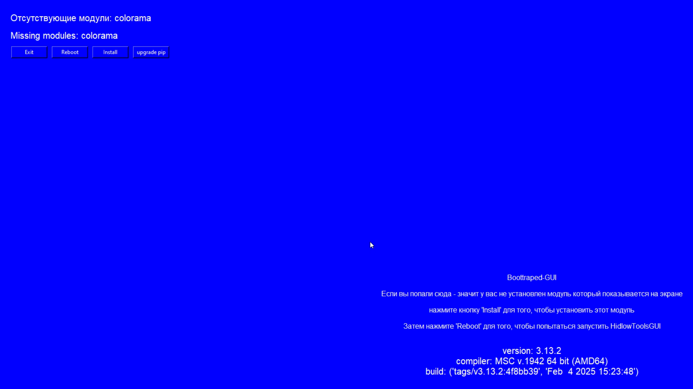

**Он нужен для того, чтобы проверять установлены ли все модули или нет.**
**При запуске проверяет все нужные для ``HidlowToolsGUI модули``. 
Если все пройдет ``успешно`` - запустит HidlowToolsGUI**

**В случае же если какой-то модуль из импорта отсутствует - 
запускает ``синий экран`` который имеет несколько функций:**

1. **``Exit`` - рассказывать много не нужно, просто выключает скрипт** 
2. **``Reboot`` - перезапускает скрипт. После перезапуска заново проверяет 
список и запускает ``HidlowToolsGUI``**
3. **``Install`` - устанавливает ``отсутствующий модуль``**
4. **``upgrade pip`` - pip так же могут не устанавливаться если у вас устаревая версия pip.
Данная кнопка решает эту проблему скачивая актуальную версию**

**Так же в BootTraper в правом нижнем углу показывается информация о python ``version``, ``build`` и ``compiler``**
***

### Console
**Встроенная консоль которая служит ``помощником`` для ``HidlowGUI``. имеет более ``16 комманд``**
1. **``clear`` - очищает консоль**
2. **``info`` - выводит ``информацию о системе``**
3. **``myip`` - выводит ``ipv4`` и ``локальный ip``**
4. **``help`` - список комманд**
5. **``time`` - актуальная ``дата`` и ``время``**
6. **``exit`` - выход**
7. **``reboot`` - перезагрузка скрипта**
8. **``fg blue`` - меняет цвет консоли на ``синий``**
9. **``fg cyan`` - меняет цвет консоли на ``голубой``**
10. **``fg red`` - меняет цвет консоли на ``красный``**
11. **``fg white`` - меняет цвет консоли на ``белый``**
12. **``ping number`` - проверяет ``Number API`` на работоспособность**
13. **``ping ip`` - проверяет ``IP API`` на работоспособность**
14. **``ping latlon`` - проверяет `` Lat/Lon API`` на работоспособность**
15. **``ping btc`` - проверяет ``BTC API`` на работоспособность**
16. **``ping ton`` - проверяет ``TON API`` на работоспособность**

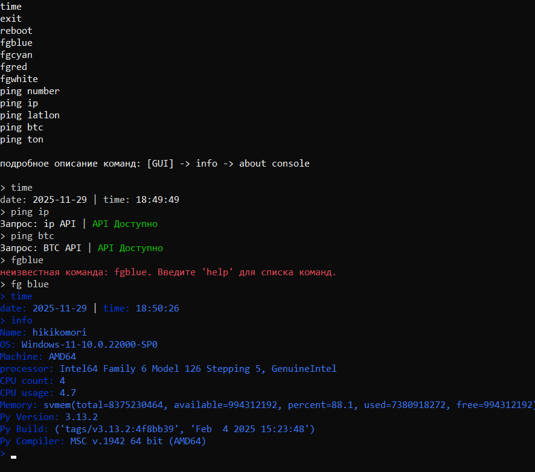
***

### Дополнительный функционал 

1. **``Info`` - информация о ``проекте`` и ``консоли``**

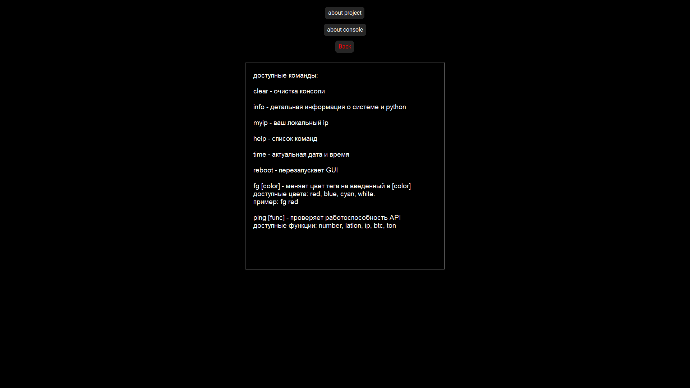
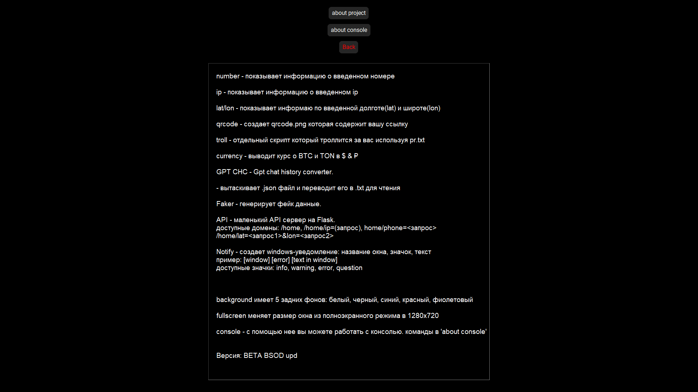

2. **``Theme`` - перейдя на ``GUI``, кастомизация начинает играть новыми красками**

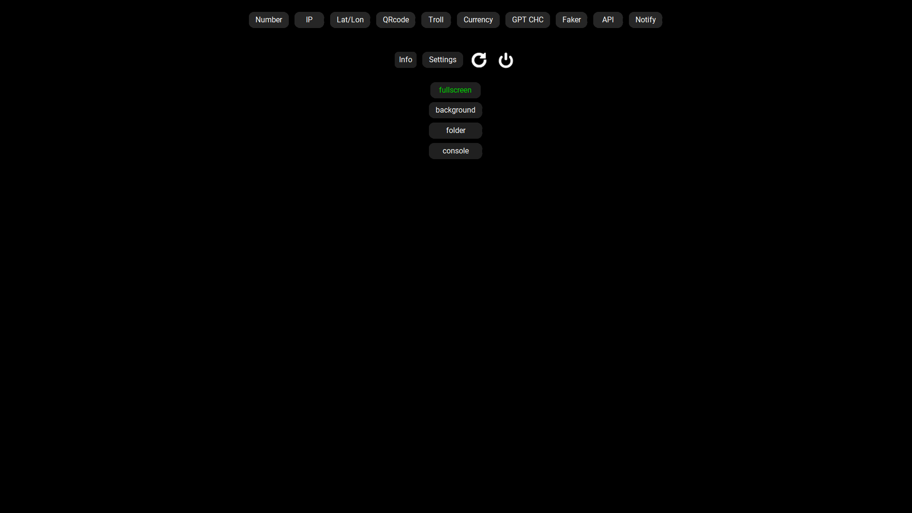

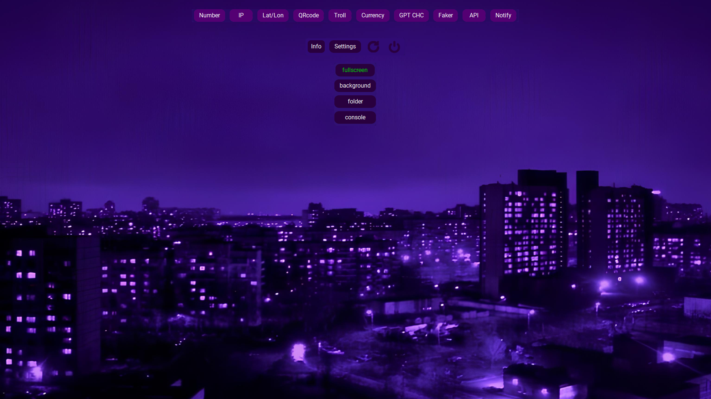

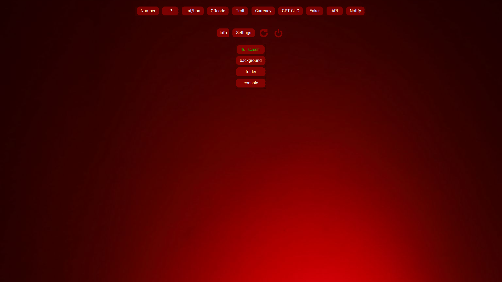

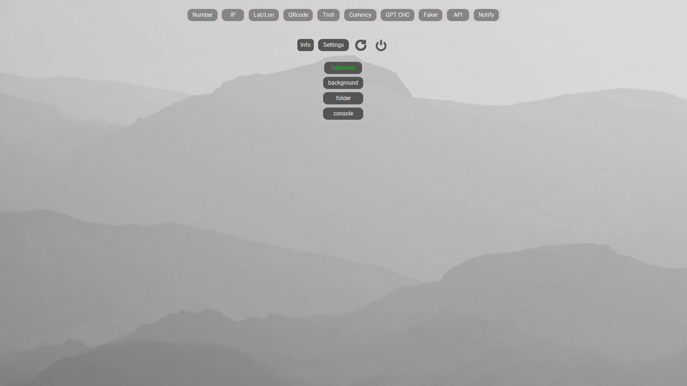

3. **``Folder`` - нажав на кнопку, вас переместит в ``текущую директорию`` с main-файлом**

4. **``Fullscreen`` - теперь вам не придется каждый раз нажимать ``f11`` для изменения размера окна,
кнопка ``Fullscreen`` сделает все за вас.**

***

### Установка

**Для начала скачиваем сборку, открываем cmd (``win + r`` → ``cmd``)**

**через команду ``cd`` указываем путь в нашу сборку**

**вставляем эту команду: ``pip install -r requirements.txt``**

**после чего запускаем ``boot traper``:
``py boot_loader.py`` или python ``boot_loader.py``**  
**P.S. ``Boot_loader`` нужен лишь когда вы впервые запускаете эту сборку, если boot loader запустил ``HidlowToolsGUI``
``без ошибок``, то можете запускать HidlowToolsGUI ``напрямую``**

